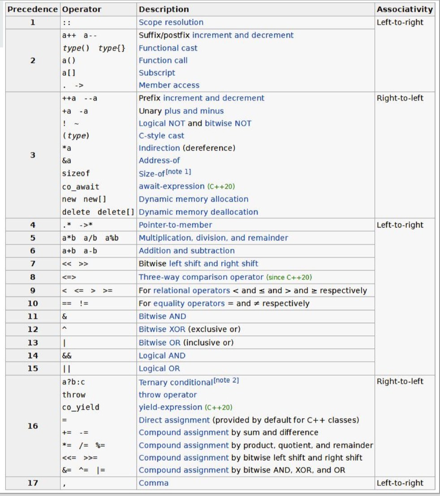
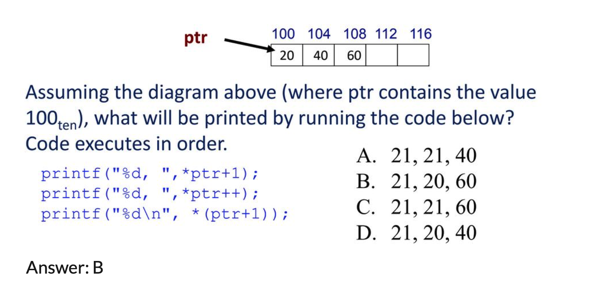
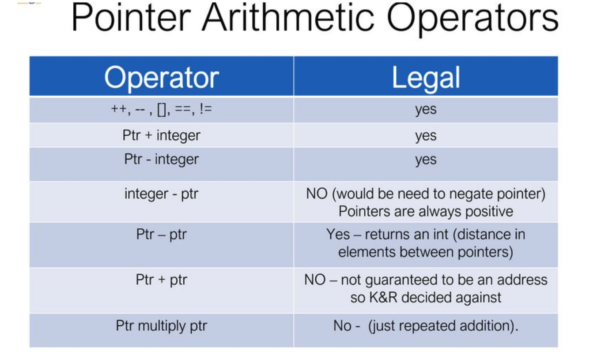
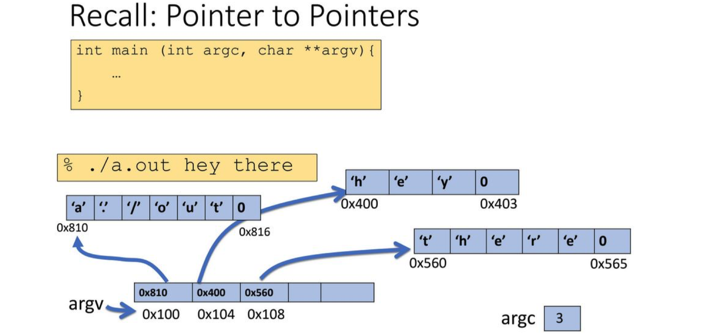
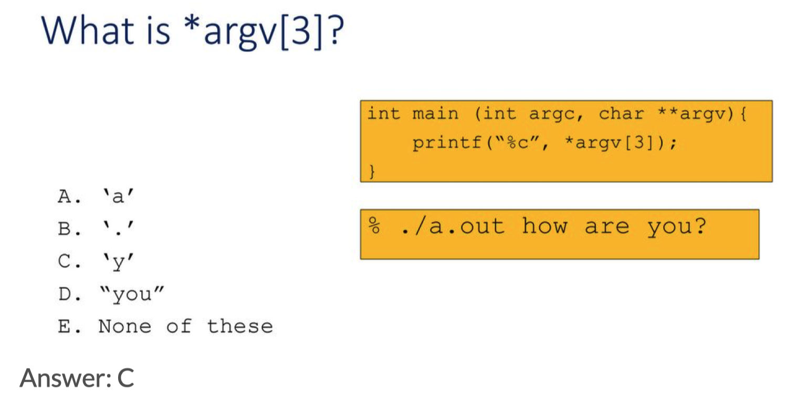
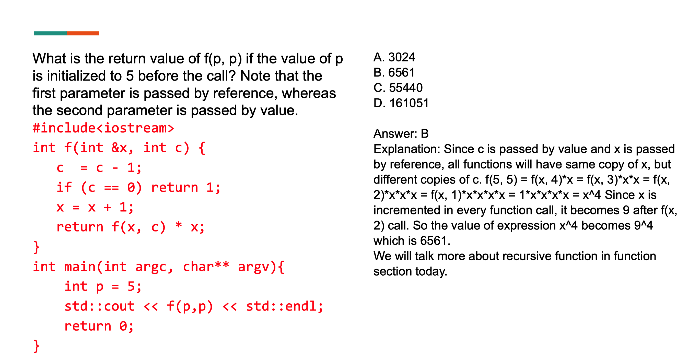

# C++ Notes

## Operator precedence



## Pointer

### The first situation

```c++
void mystery(int* ptr, int y) {
  y = 4;
  ptr = &y;
}

int main() {
  int x = 15;
  int y = 21;
  int* ptr = &x;
  mystery(ptr, y);
  std::cout << *ptr; // The result is 15. (pass by value)
  return 0; 
}
```

### The second situation

```c++
void mystery(int** pptr, int y) {
  y = 4;
  *pptr = &y;
}

int main() {
  int x = 15;
  int y = 21;
  int* ptr = &x;
  mystery(&ptr, y);
  std::cout << *ptr << std::endl; // The result is 4. (pass by reference)
  return 0;
}
```

### The third situation

```c++
void mystery(int* ptr, int y) {
  y = 4;
  *ptr = y;
}

int main() {
  int x = 15;
  int y = 21;
  int* ptr = &x;
  mystery(ptr, y);
  std::cout << *ptr << std::endl // The result is 4.
    << x << std::endl;  // The result is 4.
  return 0;
}
```

## Array

### Array declaration

```c++
int ar[5]; // declares a 5-element integer array 
int arr[] = { 795, 635 }; // declares and fills a 2-element array.
```

### Array and Pointers

- ar is a pointer to the first element

- ==ar[0] is the same as *ar==

- ==ar[2] is the same as *(ar+2)==

- Use pointers to pass arrays to functions

- Use pointer arithmetic to access arrays more conveniently

### Pointer Arithmetic

- Pointer is just a memory address, we can add to the memory address to traverse an array

- ptr + 1 will return pointer to the next element

- ++ and -- postfix and prefix operators 
  - x++ means evaluate x first then increment it 
  - --x means decrement x before evaluating it



> `ptr++` is executed after printf.
>
> The `+1` here is to move a data size, not the pointer plus one.




### Pointer to Pointer

[The reference link.](https://www.zhihu.com/question/20785765/answer/16173147)





### Recursion and Reference


